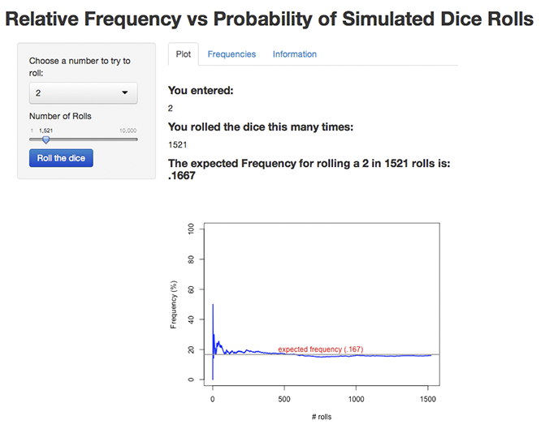
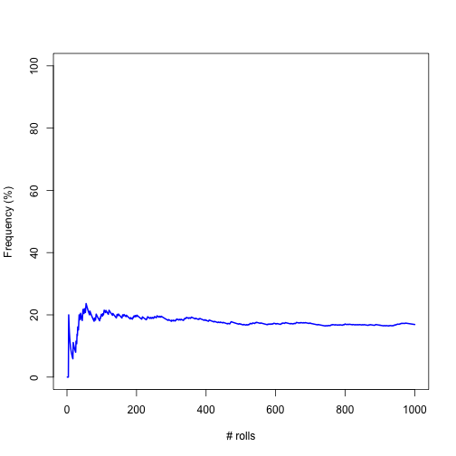

## Relative Frequency

This application provides an interactive demonstration of the relationship between relative frequency and probability of an event. 

Rolling a dice is considered a 'Bernoulli trial' in which there are only two outcomes.  Either you roll a '3' or you don't.  When a fair dice is rolled, the probability of rolling a '3' is 1/6.  Rolling a dice 1, 10, or 20 times may result in a frequency far greater or less than 1/6.  

According to the Law of Large Numbers, however, if we tossed the dice 100, 1000, or 10,000 times, and so on, we would observe that the proportion of '3's would eventually come close to the true probability of ~.167. 

This is important because it guarantees stable results for some random events over the long term when a large number of observations are taken into account.  

--- 
## The Application Console:



---

## How the Application Works: 

The user inputs a number between 1 and 6 to represent one side of the dice.  They then enter a number of rolls between 1 and 10,000.
Once the user hits the "Roll the Dice" button, the R script takes the user input and simulates up to 10,000 dice rolls, saving the results for all rolls in a single vector.
Once all rolls are complete, the code loops through and calculates the cumulative frequency of rolls that resulted in a value that matched the user input. 
 
For example, if the user chose the number 3 and 100 rolls, the code would simulate 100 rolls of the dice, then loop through and calculate the cumulative frequency for all 100 rolls, resulting in another vector of 100 frequency values.  

It is these frequency values that are used to generate the plot. 
The resulting graph, on the next slide, shows that, as the number of rolls increases, the relative frequency approaches the true probability (represented by the gray line).

---
### The Resulting Graph


```r
plot(dFreq*100,type="l",col="blue",lwd=2,ylim=c(0,100),
            xlab="# rolls", ylab="Frequency (%)")
```

 

```
## Error: plot.new has not been called yet
```

```
## Error: plot.new has not been called yet
```
---

   

